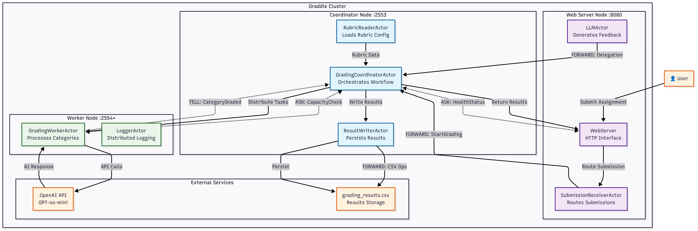

# Graddie — Distributed AI Grading System

A distributed grading system built with Akka Cluster that uses AI to grade student assignments. The system demonstrates actor-based distributed computing with multiple nodes, load balancing, and automated rubric-based evaluation.

## Project Summary

Distributed grading platform using Akka Cluster. Students submit assignments via web interface, tasks are distributed across worker nodes with OpenAI integration. Supports MCQ, Short Answer, and Essay assignments with rubric-based evaluation.

## Why This Project

Demonstrates key distributed systems concepts:
- **Distributed Processing**: Complex grading tasks split across nodes
- **Load Balancing**: Automatic work distribution to available workers
- **Fault Tolerance**: Node supervision and failure handling
- **Scalability**: Runtime horizontal scaling without downtime
- **External Integration**: OpenAI API calls in distributed context
- **Actor Model**: Message-passing concurrency patterns

## Cluster Architecture



### Node Types
- **Coordinator Node** (Port 2553): Cluster seed node that manages task orchestration, rubric loading, result aggregation, and worker supervision
- **Worker Nodes** (Port 2554+): Compute nodes that process grading tasks, integrate with OpenAI API, and handle specific rubric categories
- **Web Server** (Port 8080): HTTP interface node that serves the web UI and handles REST API requests

### Cluster Features
- **Automatic Discovery**: Nodes automatically join the cluster using Akka's cluster membership
- **Load Distribution**: Work is distributed across available workers using Akka's router patterns
- **Dynamic Scaling**: New worker nodes can be added at runtime without affecting ongoing operations
- **Failure Handling**: Cluster detects node failures and redistributes work to healthy nodes

## Persistence

- **CSV Storage**: Results in `grading_results.csv`, rubric in `final_rubric.csv`
- **Concurrent Writes**: Actor serialization ensures thread-safe file operations
- **Structured Output**: Student ID, scores, feedback, timestamps

## Node and Actor Distribution

| Node Type | Port | Purpose | Actor | Actor Function |
|-----------|------|---------|-------|----------------|
| **Coordinator Node** | 2553 | Cluster seed node, task orchestration | **GradingCoordinatorActor** | Orchestrates grading workflow, distributes tasks to workers, aggregates results, implements ASK pattern for capacity checks |
| | | | **RubricReaderActor** | Loads rubric definitions from CSV files, validates rubric structure, provides scoring criteria to workers |
| | | | **ResultWriterActor** | Persists grading results to CSV files, implements FORWARD pattern for CSV operations, manages concurrent writes |
| **Web Server Node** | 8080 | HTTP interface, user interaction | **WebServer** | Serves web UI, handles REST API endpoints, manages HTTP requests/responses |
| | | | **SubmissionReceiverActor** | Receives student submissions, validates format, implements FORWARD pattern to route to coordinator |
| | | | **LLMActor** | Manages OpenAI integration, generates overall feedback, implements FORWARD pattern for helper delegation |
| **Worker Node(s)** | 2554+ | Distributed processing, AI integration | **GradingWorkerActor** | Processes rubric categories, integrates with OpenAI API, handles MCQ/Essay/Short Answer logic, implements TELL pattern |
| | | | **LoggerActor** | Centralizes distributed logging, formats log output, coordinates cluster-wide logging |

### Node Responsibilities Summary

| Node | Primary Role | Key Capabilities |
|------|-------------|------------------|
| **Coordinator** | **Task Management** | • Cluster seed and leader election<br/>• Work distribution and load balancing<br/>• Result aggregation and persistence<br/>• Configuration management |
| **Web Server** | **User Interface** | • HTTP request handling<br/>• Submission validation and routing<br/>• Response formatting and delivery<br/>• LLM feedback coordination |
| **Worker** | **Processing Engine** | • AI-powered evaluation<br/>• Rubric-based scoring<br/>• Parallel task execution<br/>• Distributed logging |

## Communication Patterns


- **TELL**: Fire-and-forget messaging (GradingWorkerActor → Coordinator)
- **ASK**: Request-response with futures (capacity checks, health monitoring)
- **FORWARD**: Message delegation with sender preservation (routing, delegation)

## Most Important Implementation Details

### Key Features
- **Akka Cluster**: Seed nodes, member discovery, failure detection
- **Load Balancing**: Round-robin work distribution across workers
- **Horizontal Scaling**: Add worker nodes at runtime
- **OpenAI Integration**: Distributed API calls with error handling
- **Three Assignment Types**: MCQ, Short Answer, Essay with specialized logic
- **Interactive Demo**: `demo_distribution.sh` showcases all patterns

## Quick Start

### Prerequisites
- Java 17+
- Maven 3.6+
- OpenAI API key

### Running the System
```bash
# Set your API key
export OPENAI_API_KEY="your-openai-api-key"

# Start the distributed cluster
./run_graddie.sh start

# Access the web interface
open http://localhost:8080
```

### Management Commands
```bash
./run_graddie.sh stop     # Stop all nodes
./run_graddie.sh status   # Check cluster status
./run_graddie.sh logs     # View logs
```


## Demonstration

### Distribution Demo
Run the interactive demonstration to see scaling and load balancing:
```bash
./demo_distribution.sh
```

This demonstrates:
- Multi-node cluster formation
- Horizontal scaling with multiple workers
- Load balancing across nodes
- Akka communication patterns (TELL, ASK, FORWARD)

### Manual Scaling
Add additional worker nodes:
```bash
# Add more workers on different ports
java -cp target/classes:$(cat target/classpath.txt) com.agentic.GraddieMain 2555 worker
java -cp target/classes:$(cat target/classpath.txt) com.agentic.GraddieMain 2556 worker
```

## Configuration

### API Key Setup
```bash
# Environment variable (recommended)
export OPENAI_API_KEY="your-openai-api-key"

# Or create .env file in project root
echo "OPENAI_API_KEY=your-openai-api-key" > .env
```

### System Configuration
Edit `src/main/resources/config.properties`:
```properties
openai.model=gpt-4o-mini
openai.baseUrl=https://api.openai.com/v1
```

## Output

- **Results**: `grading_results.csv` (CSV file with all grading results)
- **Logs**: `logs/` directory with node-specific log files

## API Usage

Test the system programmatically:
```bash
curl -X POST http://localhost:8080/grade \
  -H "Content-Type: application/json" \
  -d '{
    "studentId": "demo_student",
    "assignment": "Assignment 1", 
    "submission": "Answer: A\nAnswer: B\nAnswer: C"
  }'
```

## Project Structure

```
src/main/java/com/agentic/
├── WebServer.java           # HTTP server and web interface
├── GraddieMain.java         # Cluster node starter
├── actors/                  # Akka actor implementations
│   ├── GradingCoordinatorActor.java
│   ├── GradingWorkerActor.java
│   └── ...
└── utils/                   # Utilities and integrations
    ├── OpenAIClient.java
    └── ...
```
